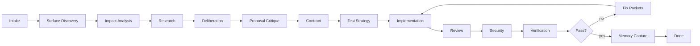

# Ship Council

> Multi-agent delivery workflow for Codex and SKILL.md-compatible coding agents.

[](LICENSE)
[](https://developers.openai.com/codex/skills)
[](https://agentskills.io)

Ship Council turns one software change request into a disciplined delivery loop:

```text
intake -> impact -> research -> debate -> critique -> contract -> test plan -> build -> review -> secure -> verify -> fix -> ship
```

It is built for the part of AI coding that usually gets messy: cross-surface changes, hidden risks, vague handoffs, skipped verification, and agents that agree too quickly.

## Why Ship Council

Most agentic coding failures happen at boundaries:

- frontend and backend implement different contracts;
- mobile, web, backend, data, and infra agents work from different assumptions;
- proposal authors drift into optimistic plans without an independent critic;
- review finds issues but does not turn them into actionable fix work;
- security checks are skipped or mixed into normal review;
- hidden callers, migrations, rollback, and docs are forgotten;
- verification is claimed without command output;
- agents debate forever instead of shipping.

Ship Council makes those boundaries explicit with artifacts, gates, independent critique, and bounded fix loops.

## What You Get

- Multi-surface orchestration for backend, web, mobile, desktop, data, infra, docs, and tests
- PRD, impact analysis, research, deliberation, contract, test plan, implementation plan, verification report, and final report templates
- Independent proposal critic to reduce sycophancy and weak plans
- Read-only review and security gates
- Fix packets that turn findings into bounded implementation work
- Surface detection and command discovery scripts
- Long-term memory templates for project constraints, commands, decisions, and lessons learned
- Design-skill routing for web and mobile UI tasks

## Install

### Codex

```bash
mkdir -p ~/.codex/skills
git clone https://github.com/HuangJingwang/ship-council /tmp/ship-council
cp -R /tmp/ship-council/skills/ship-council ~/.codex/skills/
```

Restart Codex after installing.

### Claude Code Or Other SKILL.md Agents

```bash
mkdir -p ~/.claude/skills
git clone https://github.com/HuangJingwang/ship-council /tmp/ship-council
cp -R /tmp/ship-council/skills/ship-council ~/.claude/skills/
```

For other agents, copy `skills/ship-council` into that agent's skills directory.

Marketplace/plugin packaging is planned but not published yet.

## Use

Ask your agent to use the skill:

```text
Use ship-council to implement organization filtering in the work item list.
```

For larger tasks:

```text
Use ship-council in auto mode, up to 3 fix loops, to add password reset across web and backend.
```

For design-heavy UI work:

```text
Use ship-council to redesign the onboarding flow. Route visual decisions through the design skill integration and require screenshot verification.
```

## Modes

| Mode | Use When | Behavior |
| --- | --- | --- |
| Semi-auto | You want approval checkpoints | Stops after PRD, contract, high-risk findings, repeated loop failure, and final report |
| Auto | You want the agent to keep moving | Runs normal gates automatically for up to 3 fix loops, but still stops for destructive operations, missing credentials, or policy changes |

## Workflow



## Generated Task Workspace

Ship Council writes inspectable files into the target repository:

```text
.ship-council/tasks/2026-07-09-org-filter/
  ship-council.json
  prd.md
  surface-map.md
  impact-analysis.md
  research.md
  deliberation.md
  proposal-critique.md
  contract.md
  test-plan.md
  environment-report.md
  implementation-plan.md
  findings/
  fix-packets/
  git-pr-plan.md
  verification-report.md
  retrospective.md
  memory-suggestions.md
  final-report.md
```

Long-term project knowledge can live beside task history:

```text
.ship-council/memory/
  project-profile.md
  coding-constraints.md
  surface-map.md
  verification-recipes.md
  security-constraints.md
  decisions.md
  lessons-learned.md
```

By default, Ship Council suggests memory updates instead of silently writing long-term memory.

## Design Principles

- Debate before coding.
- Independent critique before major approval.
- Contract before parallel work.
- Impact analysis before contract.
- Test strategy before implementation.
- Files over paraphrased handoffs.
- Review and security are read-only gates.
- Findings become fix packets.
- Verification must run, not pretend.
- Documentation and rollout are checked before done.
- Design-heavy web/mobile tasks route to specialist design guidance instead of inventing generic UI.
- Reusable constraints become explicit memory suggestions.
- Loops have a time-to-live.

## Repository Layout

```text
skills/ship-council/
  SKILL.md
  agents/openai.yaml
  references/
    agent-briefs/
  assets/templates/
  scripts/
```

## Included Scripts

```bash
python3 skills/ship-council/scripts/init_task.py <repo> "task title"
python3 skills/ship-council/scripts/init_memory.py <repo>
python3 skills/ship-council/scripts/detect_surfaces.py <repo>
python3 skills/ship-council/scripts/discover_commands.py <repo>
python3 skills/ship-council/scripts/validate_artifacts.py <task-dir>
python3 skills/ship-council/scripts/merge_findings.py <task-dir>
```

## Examples

- [Backend-only change](examples/backend-only.md)
- [Web and backend change](examples/web-backend.md)
- [Organization filter demo](demo/org-filter-demo.md)

## Roadmap

- Codex plugin manifest
- Claude Code plugin marketplace support
- GitHub Action for validating skill packaging
- More realistic demo traces
- Optional visual report output

## Security

Ship Council includes executable helper scripts. Review them before installing from any fork. Review and security agents are intentionally read-only, and generated findings must include concrete evidence before they can block completion.

## Contributing

Issues and pull requests are welcome. Good contributions make the workflow more reliable, more general across project types, or easier to verify.

## License

MIT
